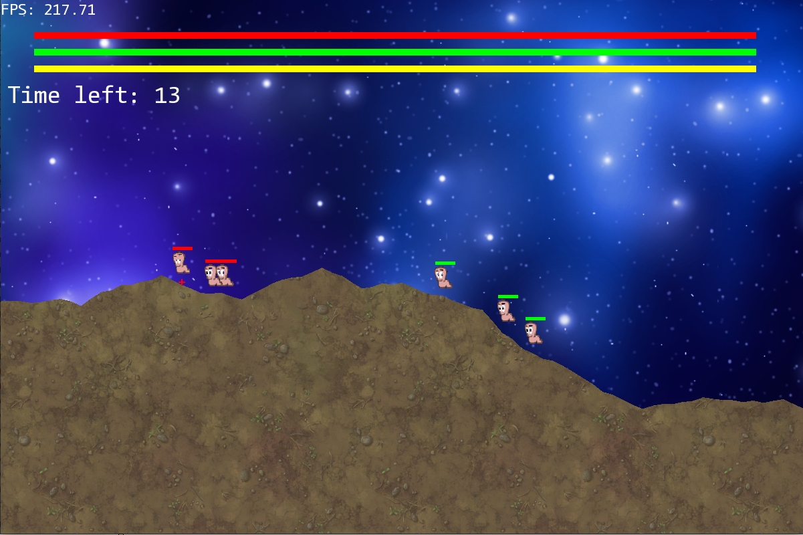
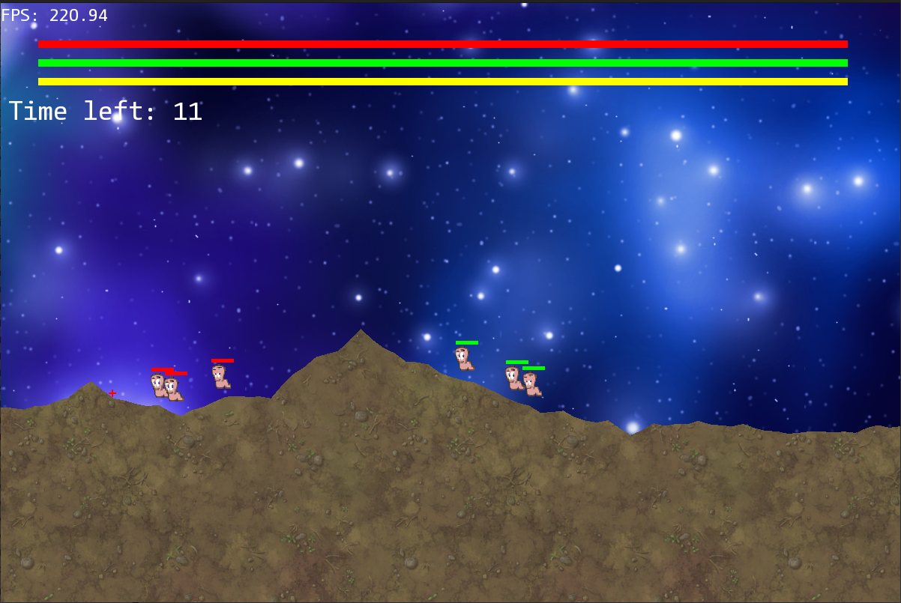
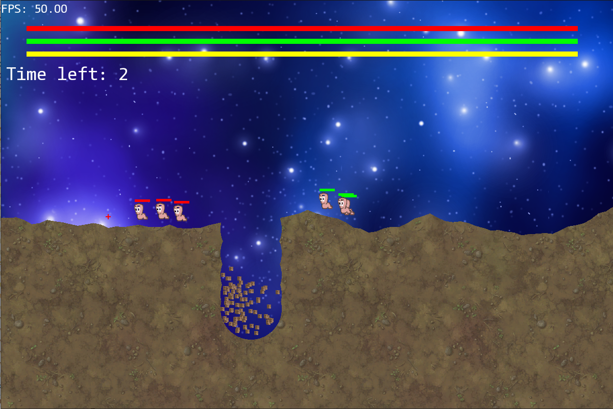
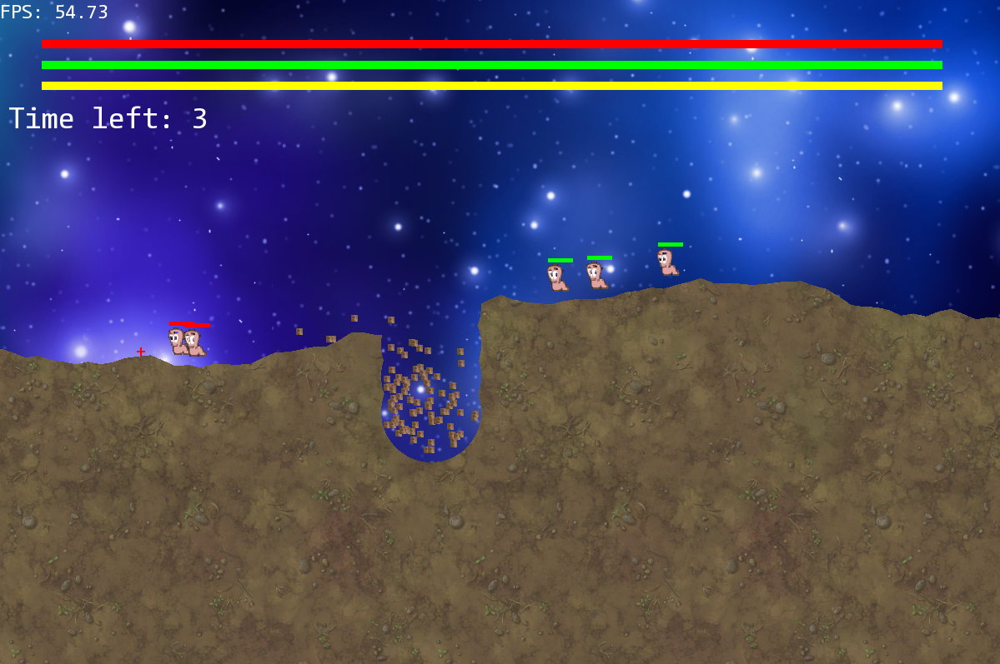
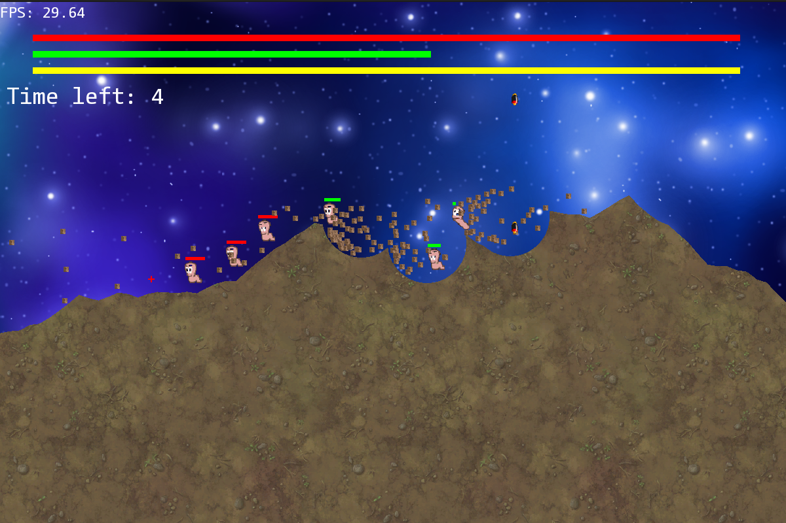
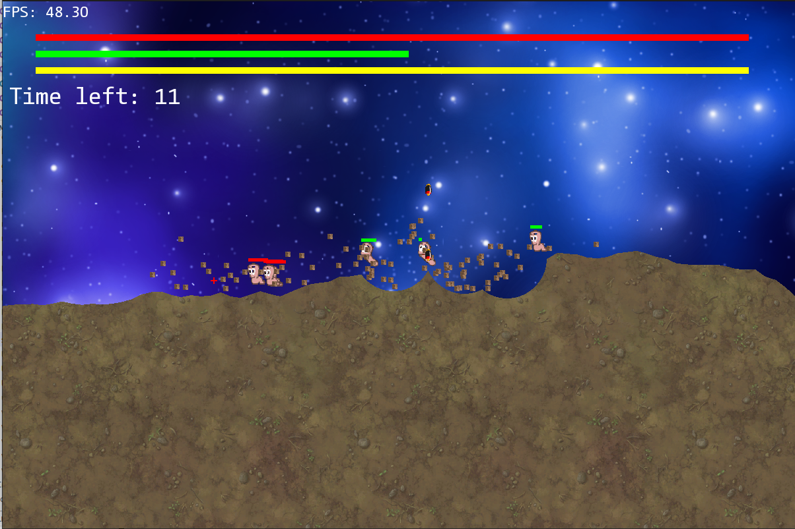
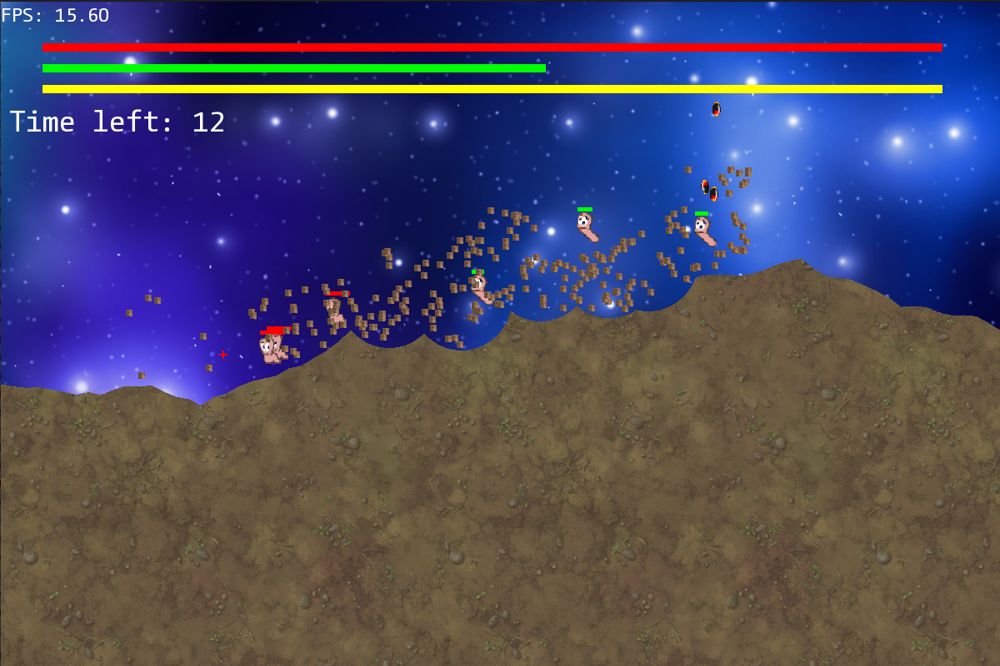

# Worms_game

The programme is free-to-use for all kinds of developers.
***
## What does the project do

This is a small clone or "Worms" game. It is also aimed to be implemented via our pseudo-STL in order to show
that STL's generality does not bring benefits in certain situations.

***
## Investigation and comparison with STL

Beneath game pictures with fps counter can be seen. They were separated by pairs, in each pair
the same number of bombs in approximately the same amount of time were spawned. In each pair
first picture is related to usage of plain _std::vector_, while another one shows FPS when using
my own implementations of _vector_, _std::move_, _std::forward_ and other things.

### No bombs

### One bomb

### Four-five bombs

### Nine-ten bombs

As it can be seen, tests have shown only a slight difference which can be neglected. My pseudo-STL
did not bring significant benefit.
***
## How can I help
I explicitly welcome any outside contributors. Use my mail: _ilichev.kv@phystech.edu_.
__A strong request__:
* Ask before making significant changes
* Do not break the codestyle
* Do not destruct previous functionality with additions

***
## Where to ask questions
Use the mail mentioned earlier.
